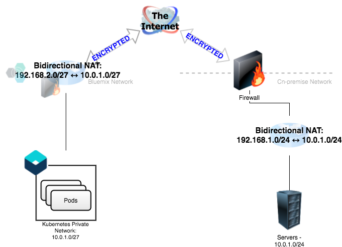

# IBM Container Service - Adding private network static routes via DaemonSet

When connecting a Kubernetes cluster to networks on-premise, we can utilize a Vyatta Gateway Appliance to serve as an IPSec VPN endpoint.

However, because all worker nodes are placed on both the private and public networks in IBM Bluemix Infrastructure, the static route table in each worker node contains a route for the private network (10.0.0.0/8) and the public network (default route). This results in the diagram below:


Because of [Reverse Path Filtering](http://tldp.org/HOWTO/Adv-Routing-HOWTO/lartc.kernel.rpf.html), the worker node will drop the response because the kernel's route table does not contain a route for where the packet originated from.

The included DaemonSet discovers the gateway for the private network (i.e. the route for 10.0.0.0/8) and adds the static routes for the on-premise subnets for the private network to the route table.

## DaemonSet Usage

Update the ConfigMap `static-routes-configmap.yaml` using an editor.  The `routes` key in the ConfigMap contains a JSON string containing an array of on-premise subnets to add to each worker nodes' static route table.

Add this to Kubernetes using the `kubectl` command:

```bash
# kubectl create -f static-routes-configmap.yaml
```

Next, create the DaemonSet which uses the `CAP_NET_ADMIN` privilege to manipulate each worker node's static route table.

```bash
# kubectl create -f add-static-route-daemonset.yaml
```

Note that the `add-static-route-daemonset` uses the `default` service account in the namespace to talk to the Kubernetes API.  Some users may wish to put the ConfigMap in a different namespace (for example `kube-system`).  Just make sure that the ConfigMap and DaemonSet are in the same namespace and the `default` service account in the namespace has permission to read ConfigMaps in the namespace the resources are deployed in.

## A note about subnet overlap

Because IBM Bluemix Infrastructure assigns the worker nodes from the Kubernetes clusters with addresses using subnets from the reserved class A block for private subnets (10.0.0.0/8), this may overlap with the address space used by many on-premise networks.  The subnet overlap may cause confusion in the IPSec endpoint as it needs to connect resources in two networks that appear to be using the same address space.

A common workaround to this problem is to define a one-to-one mapping at the router level using unused private address space using Bi-directional NAT.



In this example, the router translates the IP addresses as shown in the diagram before routing it to the destination.  When configuring the Bluemix side of the tunnel, we specify the on-premise subnet as 192.168.1.0/24 (and also place that in our ConfigMap).  Any packets destined for on-premise will be forwarded over the tunnel where the remote endpoint will translate that to the matching address in 10.0.1.0/24 before forwarding the packets to the destination.  Similarly, on the on-premise side of the tunnel, we configure the Cloud subnet as 192.168.2.0/27, and configure the Vyatta Gateway Appliance to translates that to the matching address in 10.0.1.0/27 before forwarding the packets to the destination.

